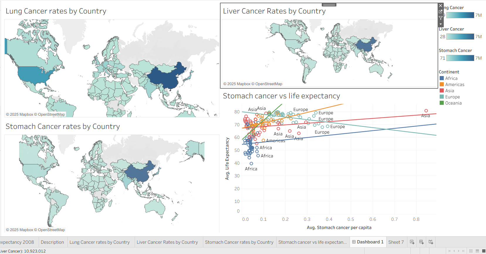
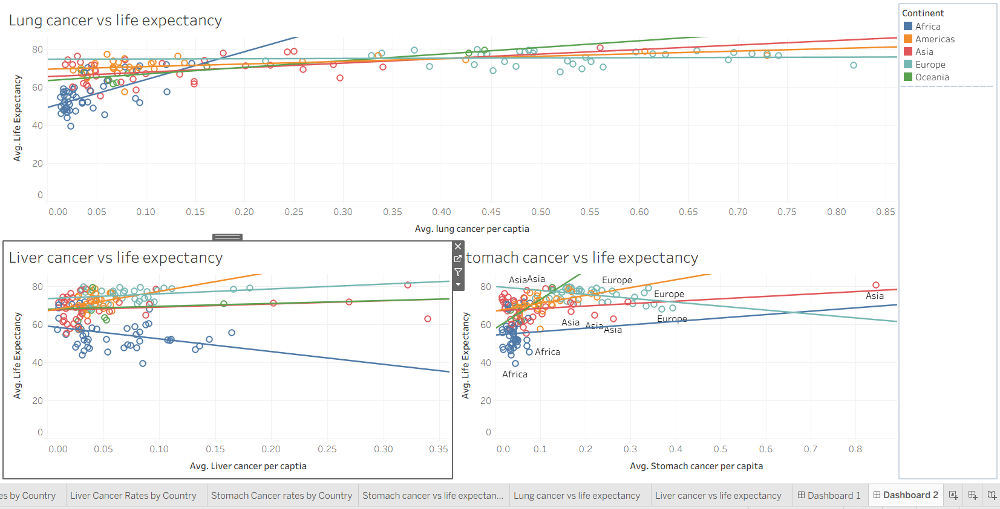
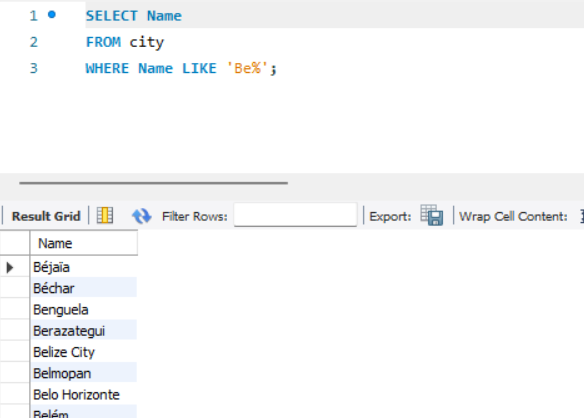

### Week 1 — Excel Foundations

**Workbook:** `Data_Technician_Workbook_Michael_Thirlaway.docx`

This first week was all about getting comfortable with Excel and the basics of working with data. I started with some of the laws and regulations around handling data (GDPR, Data Protection Act, FOI, Computer Misuse Act), then moved into practical Excel work.

**What I worked on:**

* Turning raw datasets into tables so they’re easier to work with.
* Using formulas like `SUM()` and `AVERAGE()` for simple calculations, and `IFS()` / `SWITCH()` to classify data into categories.
* Building pivot tables to quickly summarise sales and customer data.
* Creating charts to highlight trends, such as customer drop-off at the 12-month renewal stage.

**Example:**
One exercise involved looking at product sales by county (laptops, printers, smartphones). I used a pivot table to break down totals and then applied the `SWITCH()` function to group sales into “High / Medium / Low” categories. In another task, I built visuals that showed customers were most likely to leave at the 12-month renewal point — something you’d definitely want to flag to a business.

### Week 2 — Tableau & Power BI

**Workbook:** `Data_Technician_Workbook_Week_2_michael_thirlaway.docx`

In week 2 I moved on from Excel into **data visualisation tools**. We looked at Tableau first — including the difference between Tableau Public and the paid versions — and then built out reports and dashboards in **Power BI**.

**What I worked on:**

* Compared the different versions of Tableau and noted the limits of Tableau Public (like only being able to save online and no privacy).
* Built dashboards from scratch using datasets such as UK job changes, Spotify data, and global health stats.
* Used bar charts, scatterplots, and maps to spot patterns and make the data easier to understand.
* In Power BI, practiced importing, cleaning, and transforming data, then creating reports and dashboards.

**Example:**
With the health dataset, I looked at cancer rates across countries and compared them with life expectancy. The scatterplots showed that developed countries with longer life expectancy tend to have more cases of stomach and lung cancer (since people live long enough to develop them), while liver cancer rates were higher in some less-developed countries.

  


In another exercise, I built a UK dashboard showing job change percentages by city, combining a bar chart with a map to make the regional differences really clear.

### Week 3 — SQL & Databases

**Workbook:** `Data_Technician_Workbook_Week_3_michael_thirlaway.docx`

This week was all about databases and SQL. We went through the basics of how databases are structured, why keys matter, and then got hands-on writing queries.

**What I worked on:**

* Learned the difference between primary, secondary, and foreign keys, and how they connect tables together.
* Looked at different relationships (one-to-one, one-to-many, many-to-many) and when you’d see them in the real world.
* Practiced different types of SQL joins (inner, left, right, full, self, cross) and when you’d use them.
* Designed a simple database for a corner shop — customers, inventory, staff, and sales — using SQL `CREATE TABLE` statements.
* Wrote queries against a world database (`world_db`) to answer practical questions.

**Example:**
One task was to design the schema for the shop database. I set up tables for customers, staff, inventory, and sales, linking them with primary and foreign keys. For example, the **Sales** table linked customers to the items they bought.

```sql
CREATE TABLE Sales (
    SaleID INT PRIMARY KEY,
    CustomerID INT,
    ItemID INT,
    SaleQuantity INT,
    SaleValue DECIMAL(10,2),
    FOREIGN KEY (CustomerID) REFERENCES Customer(CustomerID),
    FOREIGN KEY (ItemID) REFERENCES Inventory(ItemID)
);
```

On the querying side, I used SQL to:

* Count the number of cities in the USA.
* Find the country with the highest life expectancy.
* List cities starting with “Be”.
* Identify the most populated city in the world.

  

**Takeaway:**
By the end of this week I felt much more confident with the basics of SQL — not just writing queries, but also understanding how to structure a database properly.


### Week 5 — Cloud Computing

**Workbook:** `Data_Technician_Workbook_Week_5_Michael Thirlaway.docx`

This week was focused on understanding what the cloud actually is, how businesses use it, and the laws that go along with handling data. We also spent time looking at Microsoft Azure and its services.

**What I worked on:**

* Looked at the main benefits of cloud vs running everything on-premises (cost, scalability, remote access, backups).
* Compared different providers: AWS, Azure, Google Cloud, IBM, and Oracle.
* Learned about the three main service models:

  * **IaaS** (e.g. Azure VMs for hosting a website)
  * **PaaS** (e.g. Google App Engine for app development)
  * **SaaS** (e.g. Microsoft 365 for day-to-day software)
* Looked at deployment models: public, private, hybrid, and community cloud.
* Used Azure’s **Pricing Calculator** and **TCO Calculator** to estimate costs.
* Covered UK data laws: GDPR, Data Protection Act 2018, Computer Misuse Act, Copyright law, etc.
* Completed Azure labs exploring relational and non-relational data, plus an introduction to Microsoft Fabric for building data pipelines.

**Example:**
Using the Azure Pricing Calculator, I costed up a simple web application using App Service, Azure SQL Database, and storage accounts. The estimated cost came out at about **\$1554/month**, which really highlights how you need to plan carefully for cloud spend.

We also did a group exercise where we wrote a migration plan for a fictional pet shop, “Paws & Whiskers”. The plan covered:

* Storing sales and customer data in Azure SQL/Blob Storage.
* Using Synapse Analytics and ML for insights.
* Automating data collection with Azure Data Factory.
* Visualising everything in Power BI dashboards.

**Takeaway:**
This week helped me see how cloud services fit together — not just the technical side, but also the business case and the legal responsibilities around data.

### Week 6 — Python & Pandas

**Workbook:** `Data_Technician_Workbook_Week_6_Michael Thirlaway.docx`

The final week was focused on Python, with a mix of coding fundamentals and using **Pandas** for data analysis.

**What I worked on:**

* Practiced Python basics like loops, if/else statements, and problem-solving exercises (FizzBuzz).
* Learned how to load data into Pandas using `read_csv()` and then explore it with `.head()`, `.info()`, and `.describe()`.
* Got familiar with indexing, slicing, and filtering DataFrames.
* Added and dropped columns, renamed fields, and created conditional columns (e.g. pass/fail based on marks).
* Grouped data and used aggregation functions to get averages and counts by category.
* Created pivot tables in Pandas to summarise data by class and gender.
* Exported transformed DataFrames back into CSV for re-use.

**Example:**
Using a `student.csv` dataset, I:

* Added a `passed` column for students scoring 60 or above.
* Created a `grade` column to classify marks into A, B, C, or D.
* Built a pivot table that showed the average marks for each class, split by gender.
* Exported the finished dataset as `students_with_grades.csv`.

I also worked with a GDP dataset, using Pandas to display subsets of rows and select certain columns for quick analysis.

**Takeaway:**
By the end of this week I could confidently use Python and Pandas to clean, transform, and analyse data — a big step up from where I started in Excel.


